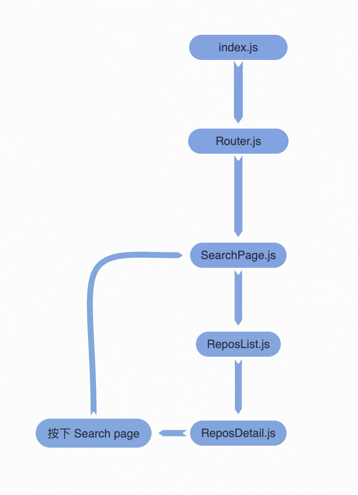

# 開啟專案步驟
## Step.1
### 將當前路徑使用 cd 指令至該專案資料夾。
 

## Step.2
### `npm install`
從 package.json install 該專案需要用到的套件。
### `npm start`
使用該指令開始運行該專案。
  

# 專案架構
該專案進入點為 index.js ，進入點會直接與 Router.js 連接，並且在 Router.js 內使用 react-router-dom 這個套件實現網頁與網頁間的切換。
  
執行 npm start 指令會直接因為 package.json 內的 homepage 參數，將預設頁面設置為 SearchPage。
  
而 SearchPage 內的搜尋按鈕，會將使用者輸入的 username 使用 Link 標籤將 username 與切換至 ReposList 的網址(/search_repository_react/users/:username/repos)串接。
  
並且在 ReposList 使用 useParams 這個 Hook 取得使用者在 SearchPage 輸入的 username 去串接 GitHub API。 
當網頁切換至 ReposList 時，會使用 useEffect 先去取得一次 API 的回傳值，在此時若是回傳值為 error 則會提醒使用者重新輸入 username，反之則去取得第一次的 API 回傳值，並將回傳值加入 repos 這個變數中，當 repos 改變時會有另一個 useEffect 去判斷網頁是否至底，若網頁至底的話，則再去取得一次 API 回傳值，重複上述順序直至沒有任何新的 Repository 可以加載，而顯示 Repository 的方式則是使用 map 去遍歷 repos 進而達到顯示的目的。
  
若是在 ReposList 按下任何一個 Repository 則會使用 useParams 這個 Hook 取得使用者是按下哪個 Repository 並將按下的 Repository name 與在 SearchPage 輸入的 username 去串接 GitHub API。 
跟 ReposList 一樣，當網頁切換至 ReposDetail 時會取得一次 API 的回傳值，並顯示在頁面上，同時將剛剛的 username 以及 Repository name 與網址串接並且在按鈕上設定一個可以連接到 Repository 的超連結。

# 例外處理
* 使用者直接按下 Enter 搜尋。
  - 若是沒有該例外處理，則會將 SearchPage 再次渲染，沒辦法直接按下 Enter 後搜尋。
* 使用者輸入錯戶的使用者名稱後搜尋。
  - 會跳出提示框。 錯誤碼(如：404)：查無此用戶，請返回搜尋頁面並輸入正確用戶帳號。
* 使用者沒有輸入任何使用者名稱後搜尋。
  - 會跳出提示框。 使用者名稱為空，請輸入用戶使用者名稱再進行查詢。
* 使用者輸入的使用者名稱正確，但是該使用者沒有任何 Repository。(可以使用 asd 這位用戶測試)
  - 會跳出提示框。 此用戶沒有任何 Repository。

# 本專案使用套件
* SearchPage
  - useState (react)
  - Link, useNavigation (react-router-dom)
  - FontAwesomeIcon (@fortawesome/react-fontawesome)
  - faMagnifyingGlass (@fortawesome/free-solid-svg-icons)

* ReposList
  - useState, useEffect (react)
  - useParams, Link, useNavigate (react-router-dom)
  - axios (axios)
  - FontAwesomeIcon (@fortawesome/react-fontawesome)
  - faBook, faStar, faRotateLeft (@fortawesome/free-solid-svg-icons)
  
* ReposDetail
  - useState, useEffect (react)
  - useParams, Link (react-router-dom)
  - axios (axios)
  - FontAwesomeIcon (@fortawesome/react-fontawesome)
  - faBook, faStar (@fortawesome/free-solid-svg-icons)

* Router
  - BrowserRouter, Routes, Route (react-router-dom)

# Deploy 至線上環境網址
https://xin0913.github.io/SearchRrepositoryReact/